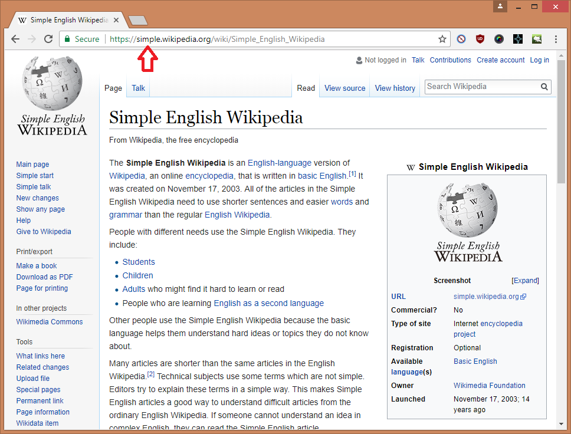

# Wikimplify

Wikimplify provides an easy link when a [Simple English Wikipedia](https://simple.wikipedia.org/wiki/Simple_English_Wikipedia) page exists for an English Wikipedia article.

People with different needs use the Simple English Wikipedia. They include:

- Students
- Children
- Adults who might find it hard to learn or read
- People who are learning English as a second language

The name is a combination of "Wikipedia" and "simplify".

## Privacy

Wikimplify will only make requests to wikipedia.org and does not "call home" in any way.

## Known issues

These are some issues I will consider resolving:

- Does not work on mobile (en.m.wikipedia.org)
- Does not link back to en.wikipedia.org (use back button or tabs)
- Cannot toggle behaviour on/off (disable app to stop it from functioning)

## Acknowledgements

- [Logo](https://publicdomainvectors.org/en/free-clipart/White-cat-vector-graphics/6801.html)